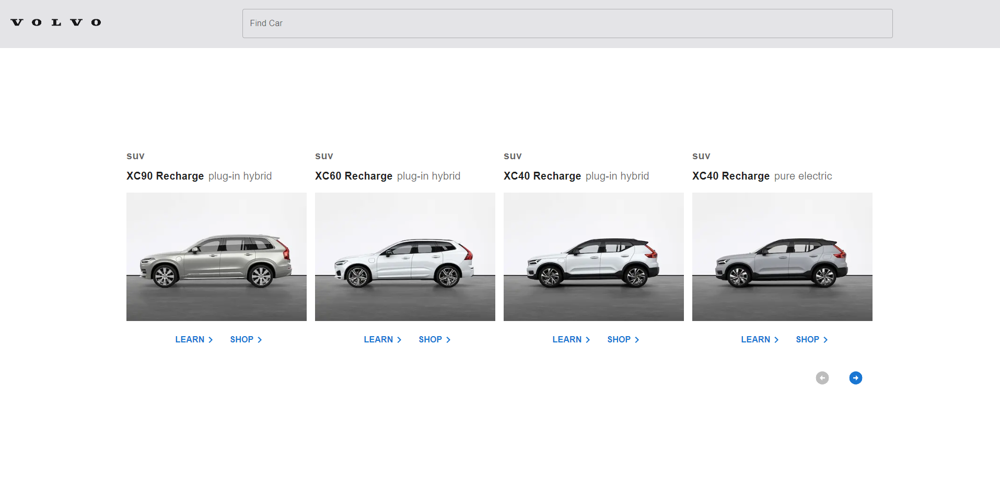

---

## 💻 About 

The objective of the project is to create a Volvo page with design for desktop and mobile, making it responsive and accessible. The project was created with NextJS and MUI.

--- 

## 🚀 Project link hosted at Vercel (click to enter)

<a href="https://volvo-test-5b1656q6p-luc4sdev.vercel.app/" target="_blank" rel="external">

</a>
<h2>Link: <a href="https://volvo-test-5b1656q6p-luc4sdev.vercel.app/" target="_blank" rel="external">Click here</a></h2>


--- 

## 💻 Requirements

Before you begin, make sure you've met the following requirements:
* Do you have an operating system: `<Windows / Linux / Mac>`
* Have you installed the latest version of `NodeJS`


## ⚙️ Installing

To install, run in the terminal:

npm:
```
npm i
```

yarn:
```
yarn install
```

## 🚀 Running the project

To run the project, run in the terminal:

npm:
```
npm run dev
```
yarn:
```
yarn dev
```

## 🚀 Technologies used

The project is developed using the following technologies:

- ReactJS 
- NextJS 
- MUI
--- 


